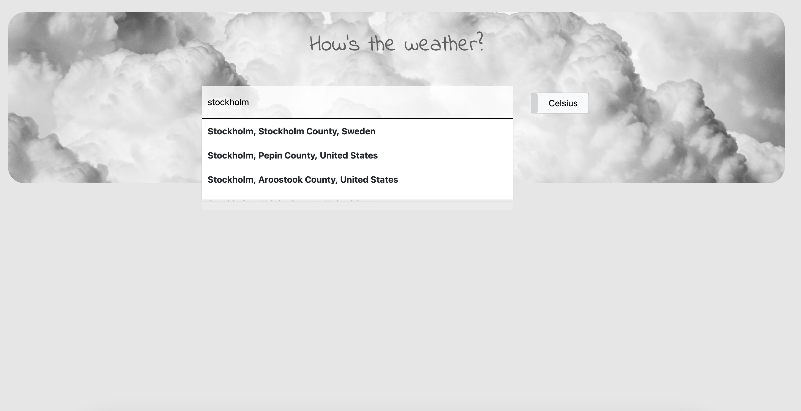
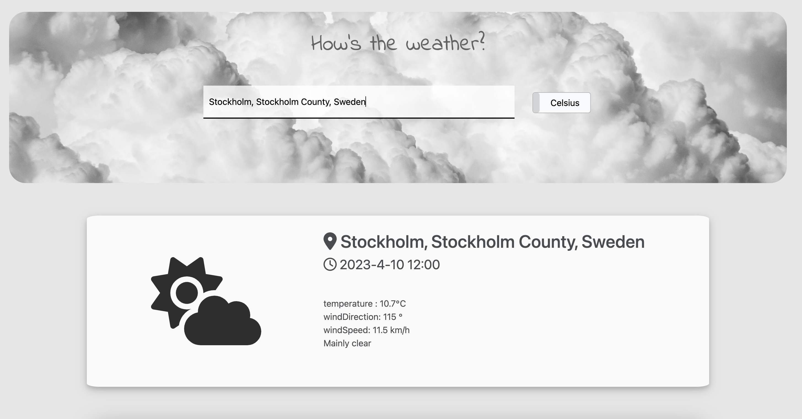

# weather-app-backend
> 
This app is the frontend part of the weather app, allowing users to search for places and recommend a list of areas for weather searches. The weather information for the selected place, such as temperature, wind direction, wind speed, and weather code, will subsequently be displayed.

## Table of Contents
* [General Info](#general-information)
* [Technologies Used](#technologies-used)
* [Screenshots](#screenshots)
* [Room for Improvement](#room-for-improvement)
<!-- * [License](#license) -->

## General Information
- For autocomplete locations and weather forecast information, two external APIs were used. The Geoapify API offered location autocomplete, and Open-Meteo was used for the Weather Forecast API.

- Following the selection of a place, information such as the date, time, location temperature, wind direction, wind speed, weather code, and weather icon will be displayed.

- The weather symbol will change dependent on the weather code, allowing the user to receive real-time information on the weather situation.

- To alter the temperature unit, the user may toggle the unit button between Celsius and Fahrenheit.

<!-- You don't have to answer all the questions - just the ones relevant to your project. -->

## Technologies Used
- JavaScript
- HTML
- CSS

## Screenshots

## Room for Improvement
To do:
- The weather API provides hourly weather data that can be used to generate charts.

<!-- Optional -->
<!-- ## License -->
<!-- This project is open source and available under the [... License](). -->

<!-- You don't have to include all sections - just the one's relevant to your project -->